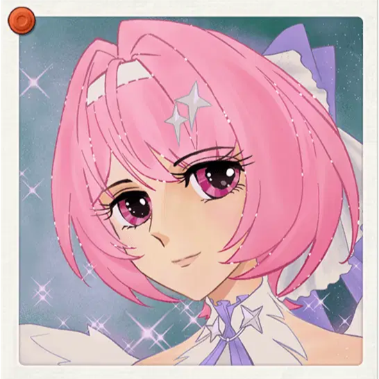
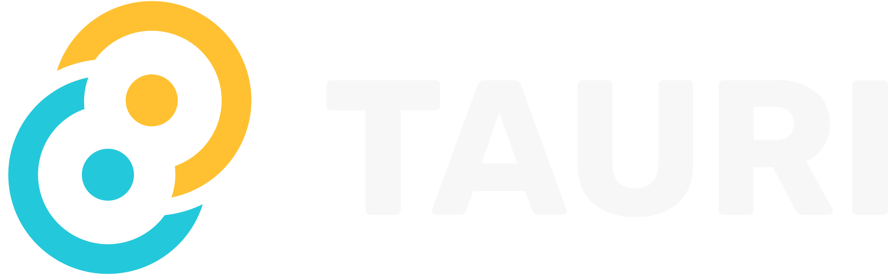

<div align="center">
  
  <h1>Remie Chat</h1>
</div>

<div align="center">
  
  <p><strong>Built with Tauri, Preact, and Rust</strong></p>
</div>

---

## Introduction

Remie is a desktop and mobile **interface** for chatting with AI. It sits on your screen as a compact chatbox, or collapses down to a simple animated icon that reacts to what you're doing.

## Storage & Config

**API keys** are stored securely and locally on your machine, using your operating system's native credential vault. They are never written in plain text and never leave your device except to call the AI provider you've connected directly.

**Other settings** (generation parameters, profile/persona settings) are saved via the Tauri plugin-store, written to a `config.json` file in your OS's AppData directory:

| OS | Location |
|---|---|
| Windows | `C:\Users\<User>\AppData\Local\<App Identifier>\config.json` (or `Roaming`) |
| Android | `N/A` |

---

## Development

### Prerequisites

- Install the [prerequisites for your OS](https://tauri.app/start/prerequisites/) before continuing.

### Setup

```bash
cd remie-chat
pnpm install
pnpm tauri dev
```

### Android
If you have Emulator, then start it:
```powershell
Start-Process -FilePath "C:\Users\<Username>\AppData\Local\Android\Sdk\emulator\emulator.exe" -ArgumentList "-avd remie_emulator"
```
Start app in development mode:
```bash
pnpm tauri android dev --host 127.0.0.1
```
If no emulator detected, the app will spin up Android Studio instead

Clean up emulator:
```bash
C:\Users\<Username>\AppData\Local\Android\Sdk\platform-tools\adb.exe shell pm clear com.pancakes.remie_chat
```

### Recommended IDE Setup

- [VS Code](https://code.visualstudio.com/)
- [Tauri Extension](https://marketplace.visualstudio.com/items?itemName=tauri-apps.tauri-vscode)
- [rust-analyzer](https://marketplace.visualstudio.com/items?itemName=rust-lang.rust-analyzer)
- [Libsodium Install](https://download.libsodium.org/libsodium/releases/)
---

## Disclaimer

The mascot assets are from a web event by **Zenless Zone Zero**. These assets are not original work and are used here for decorative an entertainment purposes only.